# SAFLE

## Deliverables
    - ✅Terraform configuration files for infrastructure provisioning.
    - ✅Dockerfile and docker-compose.yml for containerization
    - ✅CI/CD pipeline configuration (GitHub Actions, Jenkins, or similar)
    - ✅Documentation (README) explaining the setup, deployment, and monitoring.
    - ✅Link to the running application (if deployed on a public cloud) or steps to access it locally.

## Documentation
### Description
- ✅Detailed Summary of each task provided
- How to trigger the CI/CD pipeline. 
    - ✅Commit the code to main branch and pipeline will auto run 
- Steps for setting up monitoring and alerts
    - ✅ Detailed steps provided in Section Task 7 and Task 8

- Explanation of design decisions, trade-offs, and challenges
    - Design Decision 
        - Task 3 :- 
            -  Didnt create load balancer using terraform because in Section when deploying on kubernetes we can auto assign a load balancer using manifest files or helm charts and the auto scaling group get auto created aswell when in kubernetes .

        - Task 4 :- 
            - Went with Github actions , as my code was already on github , and creating a jenkins meant provisioning of another instance thus impacting the cost

        - Task 5 :- 
            - For High Availability of our application I went with kubernetes and 3 Availability Zones hence 3 nodes , Autocaling configured based on memory usage , if threshold crosses 50% , the pods will autoscale 

            - Didnt choose Instances , because of COLD START effect , provisioning an Instance takes longer than just creating another pod 

            - Didnt choose Cloud Run , because I wanted the flexibility to orchestrate my application , and have the option of community provided Monitoring and Logging Solution which are readily available in k8s

        - Task 6 :- 
            - Since we used k8s , there was no need for instance to be created for any of the task and no ssh key was used either 

            - Couldnt set up HTTPS because dont have domain
        
        - Task 8 :- 
            - I had to go with GCP provided logging solution at the end beacause ELK stack required high configuration nodes 

    - Trade-Offs :- 
        - Had to use GCP Looggin solution instead of ELK stack
        - Tried to use Github code analysis instead of Sonarqube 
        - Instead of using ingress controller used vanilla load balancer
    
    - Challenges :- 
        - Time limit was less for this whole project and becuase of this :- 
            - I often found myself going to AI chatbots instead of Documentation
            - Could have setup sonarqube if had more time
            - For github actions , could have used self hosted runner inside my k8s , but to compensate that i went with passwordless authentication between github actions and GCP

    - Architecture :- 

        

## Task 1  Node.js Application Setup
### Description
I have used a simple nodejs application and added basic unit test for atleast two end points (used jest)

### Pre-requisites
- node

### Steps to produce
- cd task-1&2
- node index.js
- open browser and redirect to http://localhost:3000/api/items
- npm test

## Task 2 Containerization with Docker
### Description
Used docker to containerize the Application that was created in task 1 and pushed to public dockerHub, and added community mysql docker image in docker-compose.yaml
NOTE :- I have also created a private artifact repository in task 4 , but for this task and to make the image available for review I have used public DockerHub , In the CICD pipeline i have used Private artifact repository .

### Pre-requisites
- Docker

### Steps to produce
- cd task-1&2&4
- docker build -t image-name:image-tag .
- docker push image-name:image-tag
- docker-compose up

## Task 3 & 5 Infrastructure as Code (IaC) with Terraform & High Availability and Load Balancing
### Description
- I have grouped task 3 & 5 where I have deployed an application in GKE , and added a Load Balancer on top of the application . All the Infra is created using terraform modules , No hardcoded values , I have used locals.tf to make sure no sensitive values are exposed . Also attached a sample locals.tf for reference .
- Infrastructure created using Terraform:- 
    - A VPC
    - 3 Subnets
    - GKE with 3 nodes 1 in each Availability zone to maintain high availability
    - Artifact registry to store our dockerized images ( private )
    - 1 Firewall for lb
    - Target Group for lb
    - Forwarding Rule for lb
    - Firewall Rules for lb
    - Network Endpoint for the service
    - Network Endpoint Group for Service
    - A managed MYSQL database

NOTE :- A load Balancer was not created using Terraform , but provisioned via manifest files in K8 and attached to our service which helps in auto matically creating auto-scaling groups for any service which gets attached to it

- To maintain high availability I have gone with kubernetes , while the other options like cloud run , or docker swarm were available , kubernetes allowed me to better orchestrate my application and also to deploy the monitoring ( task 7 ) and logging stack ( task 8 ) , I can reuse kubernetes to deploy them instead of provisioning new infra .
 

### Pre-requisites
- Terraform 
- Access to GCP

### Steps to provision infra
- cd task-3&5
- Run command " terrform init " 
- Run command " terraform plan "
- Run command " terraform apply "
- Give input " yes " after running  terraform apply

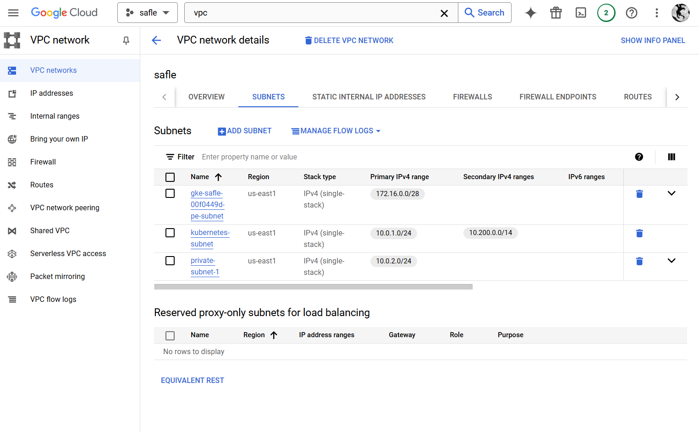

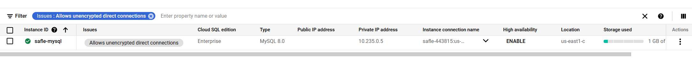

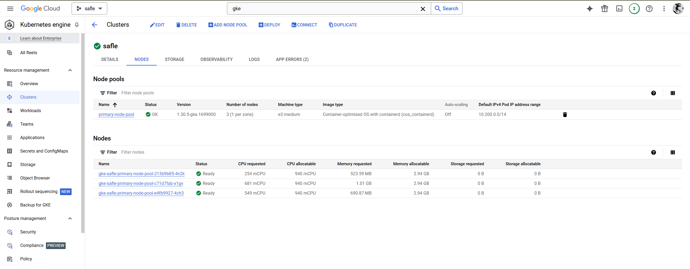

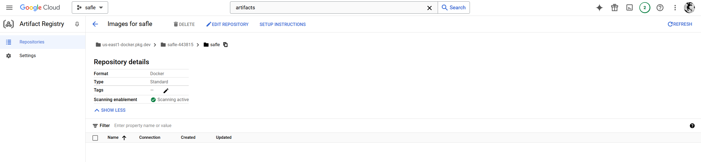

## Task 4  CI/CD Pipeline
### Description
- In this task we will deploy our nodejs app in GKE using github actions
- Before we can create our pipeline , we first need to create a connection between github and GKE
    - Create a new workload identity pool
        - gcloud iam workload-identity-pools create github-actions  --location="global"  --description="GitHub Actions tutorial" --display-name="GitHub Actions"
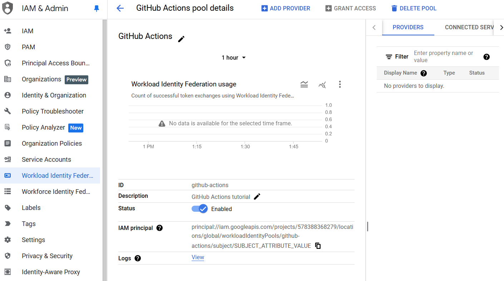
    - Add GitHub Actions as a workload identity pool provider
        - gcloud iam workload-identity-pools providers create-oidc github-actions-oidc  --location="global"  --workload-identity-pool=github-actions --issuer-uri="https://token.actions.githubusercontent.com/"  --attribute-mapping="google.subject=assertion.sub" --attribute-condition="assertion.repository_owner=='flame4592'"
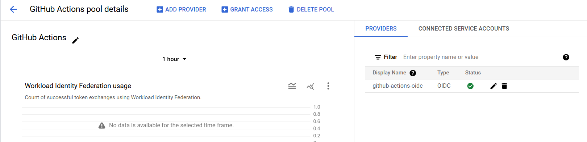
    
    - Create a service account
        - $SERVICE_ACCOUNT = (gcloud iam service-accounts create github-actions-workflow --display-name "GitHub Actions workflow" --format "value(email)")

    - Grant the Artifact Registry writer role
        - gcloud projects add-iam-policy-binding (gcloud config get-value core/project) `
        --member "serviceAccount:$SERVICE_ACCOUNT" `
        --role roles/artifactregistry.writer

    - Grant the Google Kubernetes Engine developer role
        - gcloud projects add-iam-policy-binding (gcloud config get-value core/project) `
        --member "serviceAccount:$SERVICE_ACCOUNT" `
        --role roles/container.developer

    - Allow the GitHub Actions workflow to impersonate and use the service account
        - Initialize an environment variable that contains the subject used by the GitHub Actions workflow.
            - SUBJECT=repo:OWNER/dotnet-docs-samples:ref:refs/heads/main
        - Grant the subject permission to impersonate the service account
            - PROJECT_NUMBER=$(gcloud projects describe $(gcloud config get-value core/project) --format='value(projectNumber)')

            gcloud iam service-accounts add-iam-policy-binding $SERVICE_ACCOUNT \
            --role=roles/iam.workloadIdentityUser \
            --member="principal://iam.googleapis.com/projects/$PROJECT_NUMBER/locations/global/workloadIdentityPools/github-actions/subject/$SUBJECT"

        - Allow the Compute Engine default service account to access the repository
            - gcloud projects add-iam-policy-binding (gcloud config get-value core/project) `
                --member="serviceAccount:578388368279-compute@developer.gserviceaccount.com" `
                --role=roles/artifactregistry.reader

    - Once all the permissions are in place we will create the pipeline
        - The pipeline structure looks like
        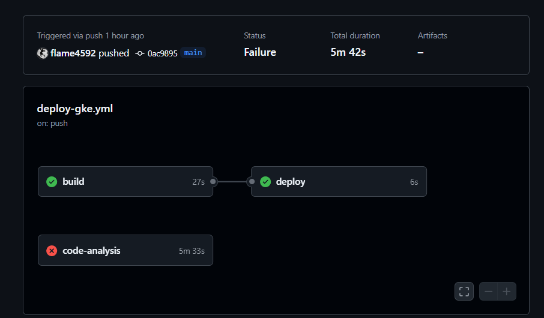
            - JOB 1 ( Code Quality Check ) :- 
                - Code Checkout
                - Code Analysis
            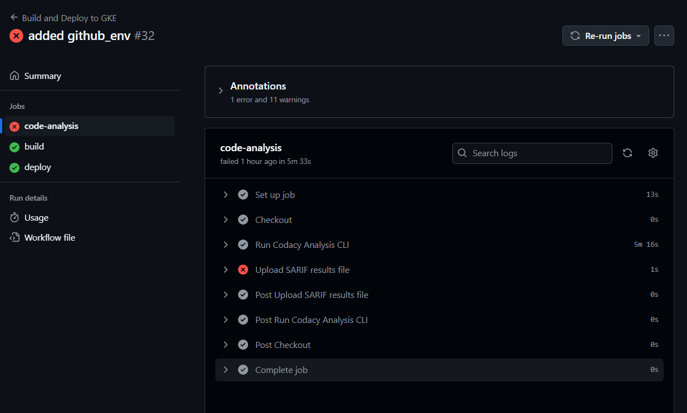
            - JOB 2 ( Build and push to Registry) :- 
                - Code Checkout
                - Unit test 
                - Obtain access token to GCP
                - Get Authenticated with Artifact Registry
                - Create image tag
                - Build Docker Image
                - Push Docker Image
            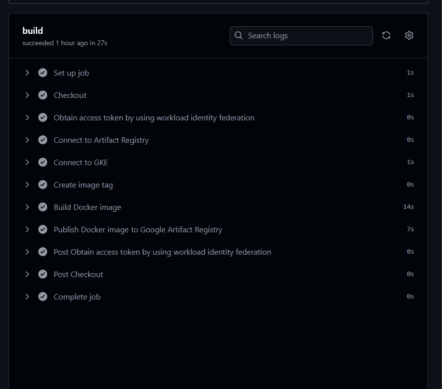
            - JOB 3 ( Deploy to K8s ) :- 
                - Obtain access token to GCP
                - Get Authenticated with Artifact Registry\
                - Get Authenticated with GKE
                - Update the image tag value with latest docker image tag
                - Apply the manifest file
            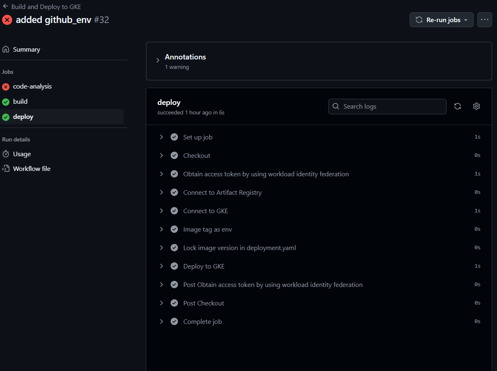
            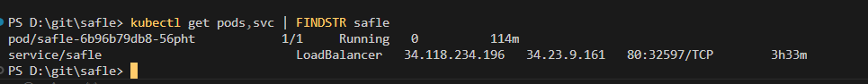

   
## Task 6 Security Best Practices 
### Description
- I have not used any ec2 instance hence no SSH key was used 
- Similarly no need to whitelist any IPS
- Used environment variables in terraform ( locals.tf ) and github actions pipelines ( secrets )
- For containers I have gone multi-stage build with Distroless Images by Google , they only have the binaries required to run the service , and not a single extra package is installed in the image making it the base image with highest security .
- Even to authenticate github action and GCP I have used OIDC connect instead of storing any passwords 

## Task 7 Monitoring and Alerts 
### Description
- To deploy monitoring stack and logging stack I have used Helm and community available charts , the settings can further be configured by using a custom values.yaml for each chart we use .

- For monitoring I have gone with widely used stack of Prometheus and Grafana , other options included google managed prometheus , or google default monitoruing 

### Pre-requisites
- Helm
- Access to GCP

### Steps to Install Prometheus
- Get Access to cluster by running :- 
    - gcloud container clusters get-credentials <cluster-name> --region <region> --project <project-id>
- Search and add helm chart 
    - helm search hub Prometheus
    - helm repo add prometheus-community https://prometheus-community.github.io/helm-charts
    - helm repo update
- Install Prometheus
    - helm install prometheus prometheus-community/prometheus
- Verify all the pods are up
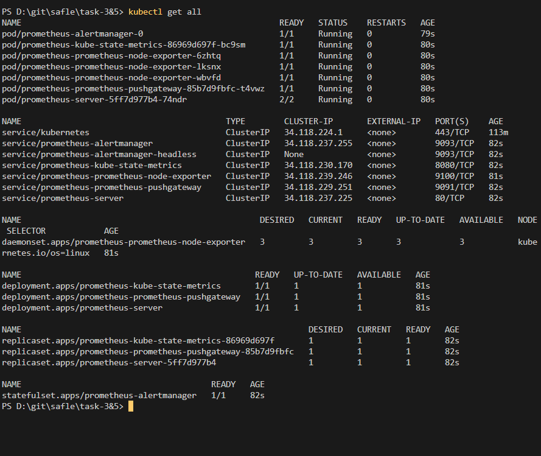
- Port forward the prometheus server to check metrics
    - kubectl port-forward service/prometheus-server 8080:9090
- Open browser and search for localhost:8080 ( 8080 is not mandatory in last step , can use any available port)
- Goto targets and verify the incoming data

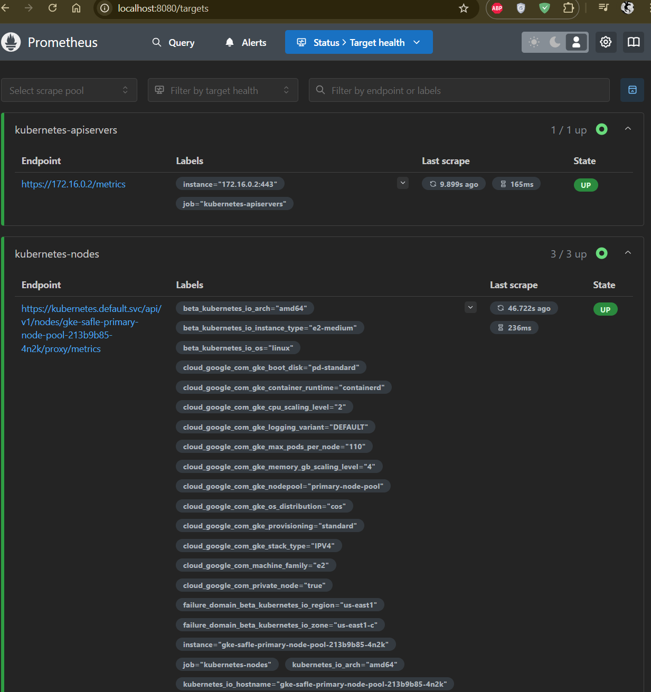

### Steps to Install Grafana
- Get Access to cluster by running :- 
    - gcloud container clusters get-credentials <cluster-name> --region <region> --project <project-id>
- Search and add helm chart
    - helm search hub grafana
    - helm repo add grafana https://grafana.github.io/helm-charts 
    - helm repo update
- Install Grafana
    - helm install grafana grafana/grafana
- Verify all the pods are up
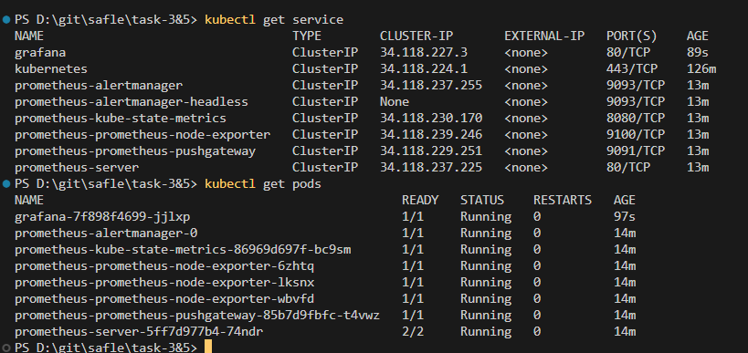
- Port forward the grafana 
    - kubectl port-forward grafana-7f898f4699-jjlxp 3000:3000
- Open browser and search for localhost:3000 ( 3000 is not mandatory in last step , can use any available port)
- Retrieve Grafana Credentials
    - kubectl get secret --namespace default grafana -o jsonpath="{.data.admin-password}" | ForEach-Object { [System.Text.Encoding]::UTF8.GetString([System.Convert]::FromBase64String($_)) }
    - paste the password 
    - username would be "admin"
- Add Datasource
    - Goto Connections -> Data Sources -> Add data source
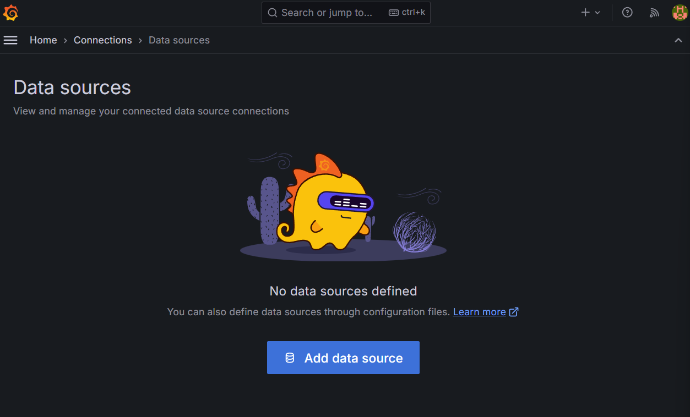
    - Check for prometheus data source 
    - Add the endpoint :- "prometheus-server.default.svc.cluster.local"
    - Click on save and test
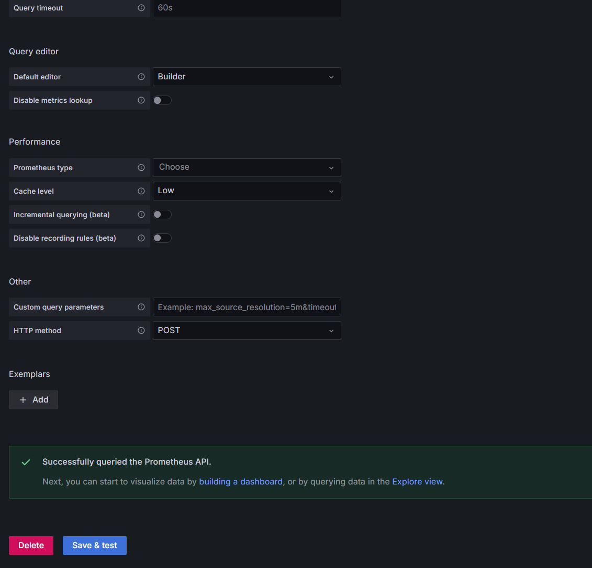
- Add dashboard
    - Get the Grafana Dashboard ID from the Grafana public Dashboard library ( https://grafana.com/grafana/dashboards/ )
    - Now go to the search dashboard, and search for Kubernetes
    - Choose Kubernetes cluster monitoring (via Prometheus)
    - Copy the ID to clipboard
    - Come back to grafana , click on dashboard , click on new and import ,paste the dashboard id and load , select the datasource we configured and click on import
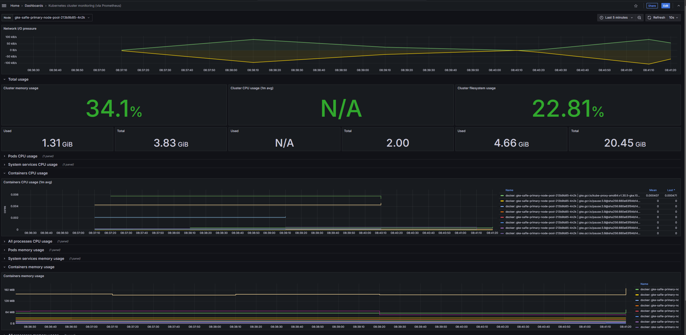

### Setting up Alert to Slack
- Navigate to https://api.slack.com/apps
- Click on create an app -> from scratch -> give it a name and choose the workspace
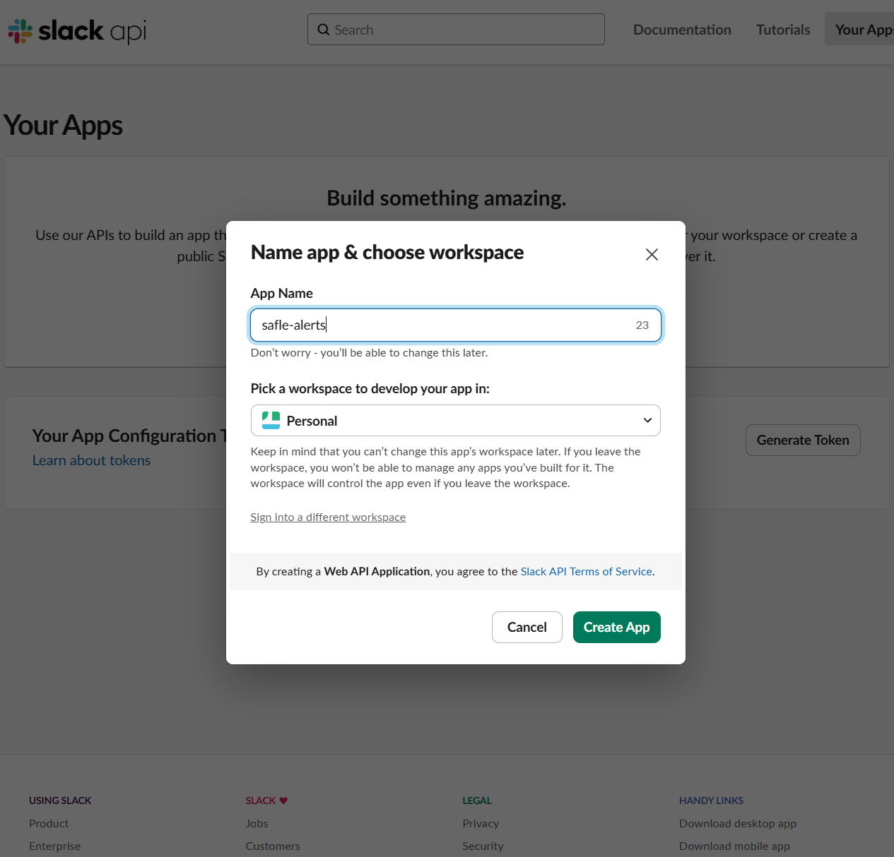
- Click on incoming webhooks and enable
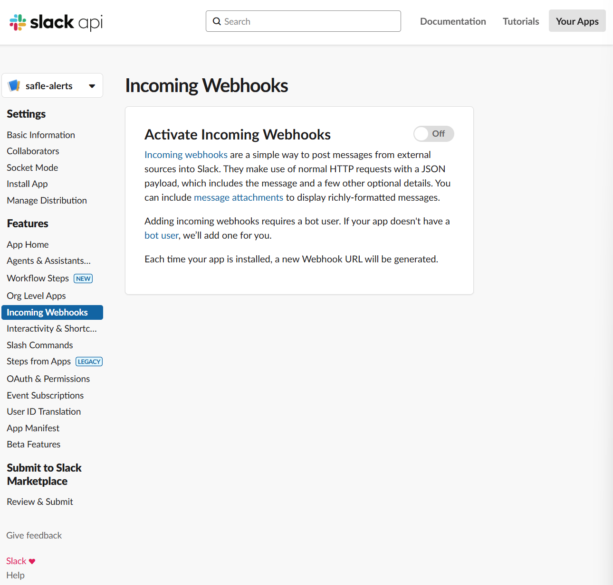
- Add a new webhook to the workspace -> Select the channel and copy the webhook URL
- Come back to Grafna -> Alerting and Contact points 
- Select Integration -> Slack , and paste the Webhook URL
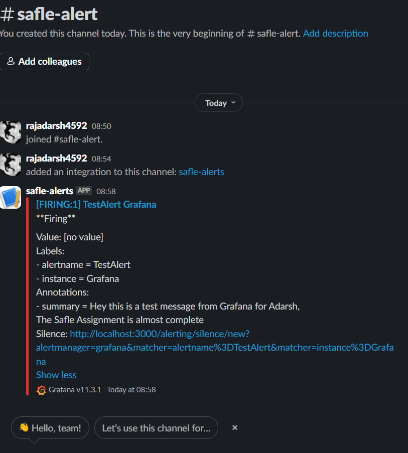
 
## Task 8 Logging and Debugging
### Description
- For logging and debugging I have used ELK stack , other options included EFK , loki with grafana

### ❌❌Setting up ELK 
- Add Elastic Helm Charts Repository
    - helm repo add elastic https://helm.elastic.co
    - helm repo update
- Install Elasticsearch
    - helm install elasticsearch elastic/elasticsearch
- Install Kibana
    - helm install kibana elastic/kibana
- Install Logstash
    - helm install logstash elastic/logstash

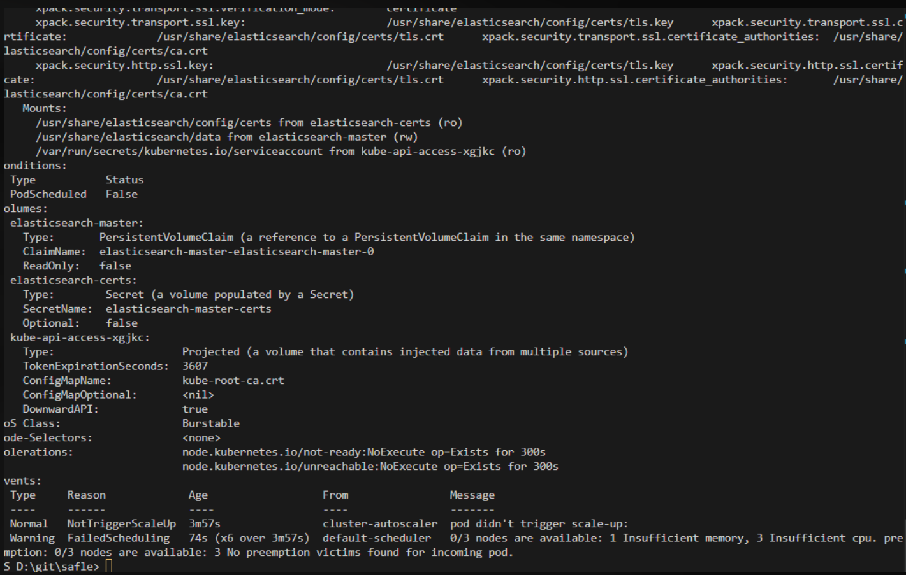

This setup could not be completed due to elasticsearch pods having excessive memory requirements , thus moving to GCP offering of logging and debugging Solution .

### Logs Explorer by GCP Monitoring 
- By Deafult GCP monitoring allows to explore and filter logs based on namespace , pod name , cluster , node and errors

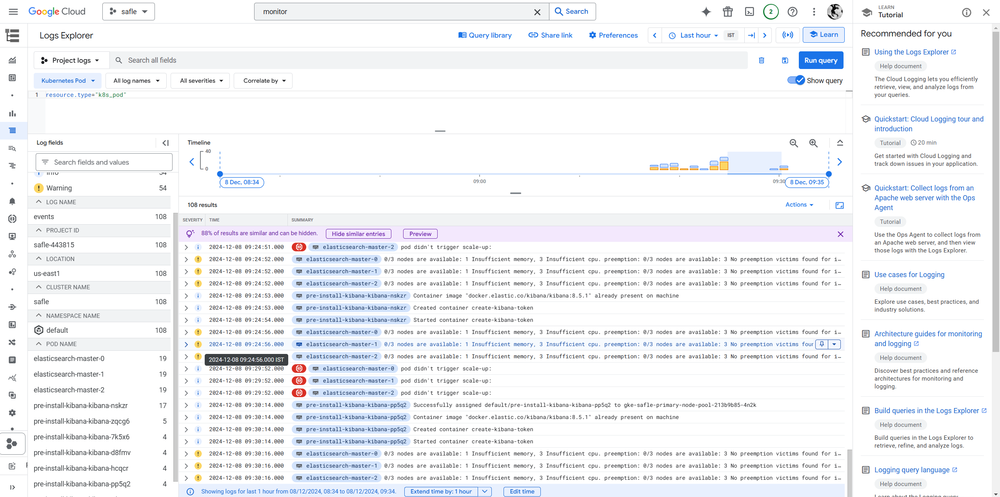

